# tiemPO — an agentic lab that lets evidence choose the next experiment

**Hack-Nation 7th Global AI Hackathon · Challenge 03: Agentic Scientific Discovery (Databricks × Omnigent)**

**Live demo:** https://commute-time-lab.vercel.app · **Data:** ENUT 2024, Mexico's National Time-Use Survey (INEGI) · **Orchestration:** Omnigent 0.16 + Databricks model serving

> Among workers aged 18–65 in Mexico City and the State of Mexico, **which part of personal time shows the strongest negative association with 5 extra hours of weekday commuting?** And does that association differ by sex or by having children at home?

tiemPO is a small, auditable discovery lab. Omnigent agents critique real results, propose falsifiable hypotheses, design competing experiments and decide what to test next. A deterministic statistics engine is the only component that produces numbers. Every step leaves a versioned JSON artifact with IDs and SHA-256 hashes. The web app replays that chain from question to updated scientific state.

---

## What the lab found

| Experiment | Question | Result | What it changed |
|---|---|---|---|
| **EXP-001** | Which of 4 time-use outcomes has the most negative association with `commute_5h`? | Sleep has the most negative point estimate: **−48.7** weekday minutes per +300 commute minutes, 95% CI [−63.5, −33.9]. The full ranking is **inconclusive**: sleep vs. leisure is not resolved after Bonferroni correction. | The critic flagged sex heterogeneity (H3) as **untested** |
| **EXP-002** | Is the commute–sleep association different for women and men? *(chosen by the Discovery Director, approved by a human)* | Women: −59.3 [−83.8, −34.8]. Men: −41.6 [−59.1, −24.1]. Interaction (difference in slopes): **−17.7 [−47.5, 12.1]**, an interval that includes zero. | **H3: UNTESTED → INCONCLUSIVE.** Tested, and recorded as unresolved. Neither a difference nor its absence is claimed |

All times are total Monday–Friday minutes in the reference week. n = 2,563 workers, representing ≈ 12.7 M people (FAC_PER weights). Every finding is an **observational association, not a causal effect**.

Full reports: [`EXP-001`](reports/experiments/EXP-001/summary.md) · [`EXP-002`](reports/experiments/EXP-002/summary.md) · [`research_state.json`](reports/discovery/local/research_state.json)

## The discovery loop

No experiment sequence was hard-coded. EXP-002 was not picked by us. It came out of the loop below, and every arrow left an artifact in [`reports/discovery/local/`](reports/discovery/local/).

```mermaid
flowchart LR
    Q[Research question] --> E1[EXP-001<br/>deterministic engine]
    E1 --> C1[Scientific Critic<br/>CRIT-EXP-001-001]
    C1 --> H[Hypothesis Agent<br/>HYP-005 · 007 · 008]
    H --> R1{{Human review<br/>REV-001}}
    R1 --> P[Experiment Planner<br/>PROP-003 · 005 · 008 · 009]
    P --> D[Discovery Director<br/>DEC-001 … DEC-005]
    D --> R2{{Human approval<br/>REV-DEC-005-001}}
    R2 --> E2[EXP-002<br/>commute × sex on sleep]
    E2 --> C2[Scientific Critic<br/>CRIT-EXP-002-002]
    C2 --> S[Updated state<br/>H3 → INCONCLUSIVE]
    S -. next_action .-> H
```



**The moment the plan changed.** The Planner proposed a formal commute × sex interaction test (PROP-003) and an exploratory women-only model (PROP-005). The women-only model could run immediately, but by itself it cannot show that women and men differ. The Director preferred the scientifically stronger test and recorded **`DEC-001 = WAITING_FOR_ENGINE_CAPABILITY`** instead of settling for the runnable one. We then extended the engine with binary-moderator interactions, keeping the same tests and leaving EXP-001 unchanged bit for bit. The Director re-ran its audit and issued `DEC-002 = READY_TO_EXECUTE`. After validator hardening (DEC-003, DEC-004), a human approved DEC-005, and EXP-002 ran.

The system's own `next_action` is now the Hypothesis Agent, using CRIT-EXP-002-002 as input. Its open questions are non-linearity, moderation by children in the household, and the other three outcomes. We do not pick EXP-003 by hand.

## Agents

Agents do not chat. They exchange one **Shared Research State** JSON object and pass IDs between steps, not prose ([`docs/RESEARCH_STATE.md`](docs/RESEARCH_STATE.md)). Each agent owns one scientific decision.

| Agent | Decision it owns | Ran on a real LLM in this repo |
|---|---|---|
| **Scientific Critic** | Is this result reliable, and what does it leave open? | ✅ [`CRIT-EXP-001-001`](reports/discovery/local/critiques/CRIT-EXP-001-001.json), [`CRIT-EXP-002-002`](reports/discovery/local/critiques/CRIT-EXP-002-002.json) |
| **Hypothesis Agent** | Which falsifiable explanation is worth testing? | ✅ [`HYP-005`](reports/discovery/local/hypotheses/HYP-005.json), `HYP-007`, `HYP-008` |
| **Experiment Planner** | Which candidate experiments compete, and are they feasible under the engine contract? | ✅ [`PROP-003`](reports/discovery/local/candidates/PROP-003.json), `PROP-005`, `PROP-008`, `PROP-009` |
| **Discovery Director** | What to investigate next, chosen by expected learning and not by likely significance | ✅ [`DEC-001`](reports/discovery/local/decisions/DEC-001.json) … [`DEC-005`](reports/discovery/local/decisions/DEC-005.json) |
| **Experiment Runner** | Run the approved spec reproducibly | Engine ran EXP-002 after human approval; the agent wrapper is in [`omnigent.yaml`](omnigent.yaml) |
| **Literature Agent** | Which evidence answers the open questions? (RAG over INEGI docs, OpenAlex, Bright Data) | Tools implemented and tested; not yet in a full LLM session |
| **Data Steward** | Can the approved data test this hypothesis? | Tools implemented and tested; not yet in a full LLM session |

- **Model:** `databricks-gpt-oss-120b` on Databricks model serving, through the Omnigent `openai-agents` harness.
- **Specs:** [`omnigent.yaml`](omnigent.yaml) wires all 7 agents (Director as root plus 6 sub-agents, 15 tools, human-approval policy). The four specialists above also ran as standalone Omnigent specs in [`agents/`](agents/), chained through committed artifacts.

## Why you can trust the numbers

- **One computational path.** Agents never compute or invent statistics. They write a strictly validated `ExperimentSpec`, and the deterministic engine in [`src/experiments/`](src/experiments/) returns an `ExperimentResult`. Unknown variables, methods or fields are rejected. There is no SQL or shell access to the data.
- **Reproducible by construction.** The engine checks the dataset SHA-256 before and after each run, runs every spec twice and requires identical results. The re-run script reproduces EXP-001 across Windows and Linux within a relative tolerance of 1e-9.
- **Validators that refuse overclaiming.** Agent outputs are rejected if they contain causal language ("effect", "reduces"), numbers absent from the source artifact, ranking claims the engine did not support, untested variables presented as evidence, or a decision that picks a test because it will "resolve" the question.
- **Human gates.** Hypotheses are reviewed before planning ([REV-001](reports/discovery/local/reviews/REV-001.json)). `run_experiment` and `record_decision` require human approval ([REV-DEC-005-001](reports/discovery/local/reviews/REV-DEC-005-001.json)). Every engine result stays `REQUIRES_HUMAN_REVIEW`.
- **Provenance everywhere.** Each artifact records its inputs, their hashes, the model and the code version. The UI links every card to its file on GitHub at the commit that produced it.
- **Tested.** 35 engine tests (checked against `statsmodels`) and 49 agent-tool tests.

## Try it

**1. Watch the replay (no setup).** Open https://commute-time-lab.vercel.app and press *Run discovery*. The agents take turns as in the recorded session, each listing the artifacts it saves before its result appears, and the conclusion arrives last. `/?view=full` opens the whole record at once.

**2. Reproduce the numbers** (Python 3.12, from the repo root):

```bash
uv venv -p 3.12 .venv-experiments
uv pip install -p .venv-experiments/bin/python -r requirements-experiments.txt
.venv-experiments/bin/python scripts/validate_experiment_engine.py           # hashes, schema, tests, EXP-001 re-run
.venv-experiments/bin/python scripts/run_experiment.py experiments/EXP-002/spec.json
PYTHONPATH=. .venv-experiments/bin/python -m unittest discover -s tests
```

> `run_experiment.py` rewrites `reports/experiments/<id>/`. Run `git diff` afterwards: on the same platform there should be no numeric changes.

**3. Run the agents** (Omnigent 0.16 and a Databricks workspace token):

```bash
uv tool install --python 3.12 "omnigent[databricks]" --with supabase
cp .env.example .env               # fill in DATABRICKS_TOKEN (+ Supabase keys for the full spec)
set -a; source .env; set +a
# ~/.omnigent/config.yaml needs the `databricks-serving` provider (see AGENTS.md §10 / MEMORY.md §5)

PYTHONPATH=agents omnigent run agents/scientific_critic.yaml -p "Critique the committed experiment EXP-002."
PYTHONPATH=agents omnigent run agents/discovery_director.yaml -p "Decide the next experiment."
PYTHONPATH=agents:analysis omnigent run omnigent.yaml -p "$(cat initial_state.json)"   # full 7-agent loop

python scripts/build_research_state.py && (cd web && npm run snapshot)   # refresh state + UI after new artifacts
```

**4. Run the web app locally:**

```bash
cd web && npm install
npm run dev               # http://localhost:3000  (?mode=live reads reports/ every 3 s)
npm run test:discovery    # acceptance checks A–L
```

## Repository map

| Path | What it is |
|---|---|
| [`omnigent.yaml`](omnigent.yaml), [`agents/`](agents/) | Agent specs, tools (`commute_lab/`), human-approval policy |
| [`src/experiments/`](src/experiments/) | Deterministic engine: `ExperimentSpec` → `ExperimentResult` |
| [`experiments/`](experiments/), [`reports/experiments/`](reports/experiments/) | Specs and results for EXP-001 and EXP-002 |
| [`reports/discovery/local/`](reports/discovery/local/) | Critiques, hypotheses, candidates, decisions, human reviews, `research_state.json` |
| [`data/processed/analytic_v1.parquet`](data/processed/) | Canonical dataset: one row per person, hash-pinned |
| [`docs/`](docs/) | Data contract, scientific and experiment protocols, engine contract, demo storyboard |
| [`analysis/rag/`](analysis/rag/) | RAG over 535 passages of official ENUT 2024 documents (hybrid search on Supabase pgvector) |
| [`web/`](web/) | Next.js 16 discovery UI (Vercel) |
| [`supabase/`](supabase/) | Migrations, RLS (read-only for the public), audit store |

## Scaling opportunities

The architecture is domain-agnostic: any dataset with a data contract and an approved engine method can enter the same loop. These are the next steps, each building on what already runs:

- **Full survey-design variance.** The engine uses FAC_PER weights with UPM-clustered CR1 errors. Adding stratum centering, finite population correction and replicate weights would match ENUT's complex-survey variance exactly.
- **A richer method registry.** The engine already gained binary-moderator interactions mid-run. Next come non-linear commute terms, multi-level moderators and equivalence tests, which answer the critic's open questions. Each new method follows the same path: schema, tests and human approval.
- **National and multi-year coverage.** Today's population covers Mexico City and the State of Mexico at the state level. Adding the rest of ENUT 2024 and earlier waves would allow regional and trend comparisons.
- **One continuous Omnigent session.** The Critic, Hypothesis Agent, Planner and Director already ran on a real LLM. The full 7-agent spec, including the Literature Agent and Data Steward, validates and passes its end-to-end tool tests. The next step is running the whole loop in a single session.
- **A measured speed-up.** 10× is our target. Timing a manual baseline on the same dataset and corpus will turn it into a measured number.
- **Built-in human review.** EXP-001 and EXP-002 await expert review (`REQUIRES_HUMAN_REVIEW`). A review step in the UI would close that gate inside the product.

*Scope of claims:* ENUT is observational and cross-sectional, so every result here is an association, not a causal effect.

## Data and credits

- **Data:** *Encuesta Nacional sobre Uso del Tiempo (ENUT) 2024*, © INEGI, used under INEGI's open-data terms. Raw microdata are not redistributed; the repo contains only the derived analytic file and aggregates.
- **Built with:** [Omnigent](https://github.com/omnigent-ai/omnigent), Databricks model serving, Supabase + pgvector, `intfloat/multilingual-e5-small`, OpenAlex, Bright Data and Next.js on Vercel.
- **Team:** Rogelio Zuriaga Reza · Emilio Zdenko Abarca Cruz · Diana Guadalupe Lopez Carmona · Alberto Valdez Reyes
